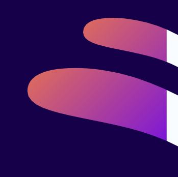

    

        
    

    

        <h3>EPIC UI</h3>
        
Frontend css framework based on flexbox. Framework includes its own vanilla javascript functionalities for fast prototyping.  

        <a>Read Docs</a> / <a>Report bugs</a> / <a>Request feature</a>
    

# Installation
You can include only css file from the framework but components which have 'js' in website tag will not work.For full docs <a>read here</a>.

* NPM `npm install epic-ui`
* CLONE `git clone https://github.com/epicbg/epic-ui.git`
* CDN -> <a>browse cdn files here</a>
`<link href="https://cdnjs.com/ajax/libs/epic-ui.min.css"></link>` 
``
* <a>DOWNLOAD</a> and link the files
`<link href="vendor/epic-ui/dist/css/epic-ui.min.css"></link>` 
``

