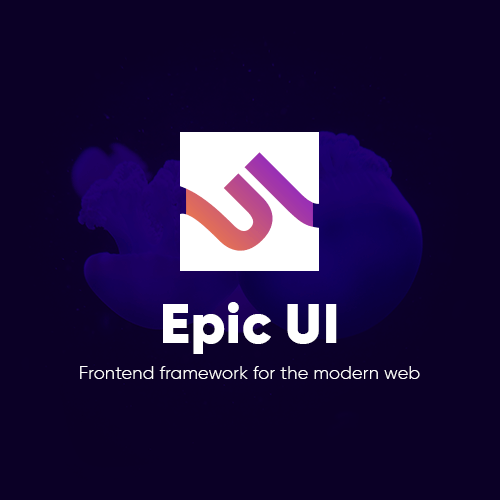

        
        
Frontend css framework based on flexbox. Framework includes its own vanilla javascript functionalities for fast prototyping.  

        <a href="https://ui.epicweb.bg/docs">Read Docs</a> / <a href="https://github.com/epicbg/epic-ui/issues">Report bugs</a> / <a href="https://github.com/epicbg/epic-ui/issues">Request feature</a>
    

<h1 align="center">COMING SOON</h1>

